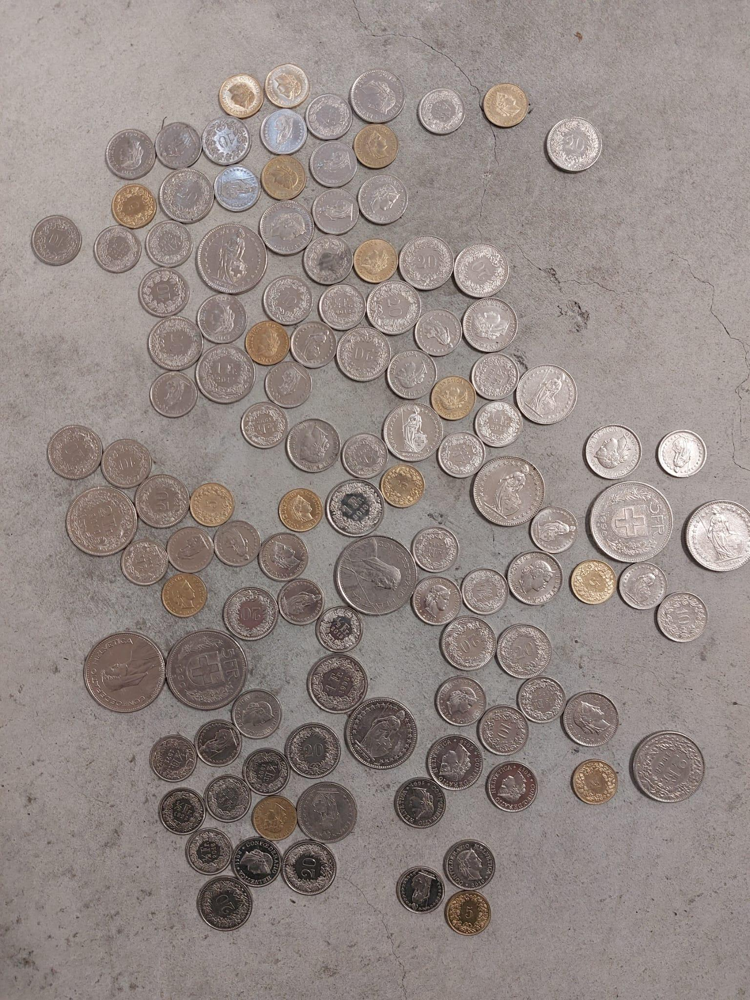
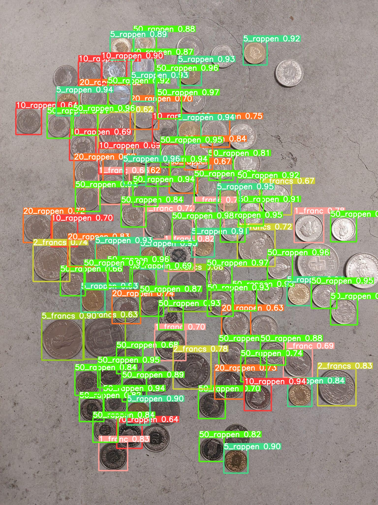

## Overview

This project is a coin counting tool that uses YOLO (You Only Look Once) for coin detection in images. It's designed to help you count coins in photos easily. You can input raw images containing coins, and the system will detect and count them, showing the results visually.

## Features

- **Coin Detection**: Automatically detects coins in your images.
- **Coin Counting**: Provides the total count of coins found.
- **User-Friendly**: Easy-to-use, even for non-technical users.
- **Visual Results**: Displays the detected coins and count on the images.

## Usage

1. **Clone the Repository**: Clone this GitHub repository to your computer.

2. **Add Your Images**: Place the images you want to analyze in the project directory.

3. **Run the Detector**: Use the provided script to detect and count coins in your images.

View Results: Open the output image to see the detected coins and the total count.
Example
Input Image:

Detected Coins:

Customization
If you have a specific type of coin or need to customize the detection, you can fine-tune the YOLO model with your own images. Refer to the documentation for details.

Support
For any questions or issues, please create a GitHub issue or contact us at saad992.sm@gmail.com.